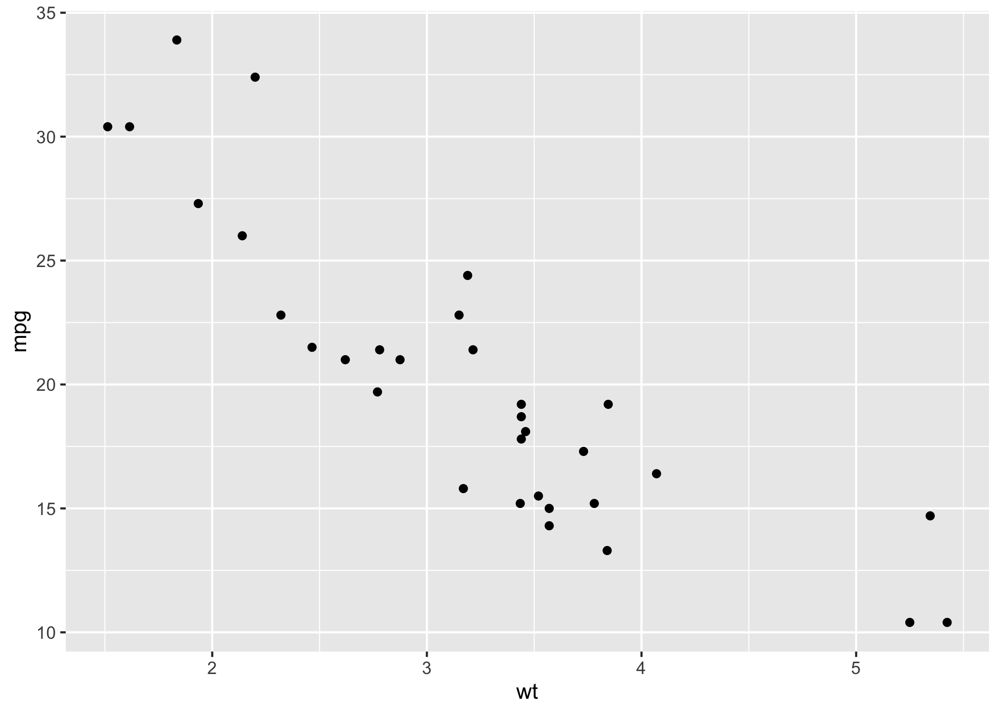

<!-- README.md is generated from README.Rmd. Please edit that file -->

# ricardo 

<!-- badges: start -->

[](https://www.codefactor.io/repository/github/jvieroe/ricardo)
[](https://github.com/jvieroe/ricardo/actions)
<!-- badges: end -->

| Country | Leage          | Code |
|---------|----------------|------|
| England | Premier League | E0   |
| England | Championship   | E1   |
| England | League 1       | E2   |
| England | League 2       | E3   |
| England | Conference     | E4   |

``` r
library(ggplot2)

df <- mtcars

ggplot(data = df, aes(x = wt, y = mpg)) + 
  geom_point()
```


